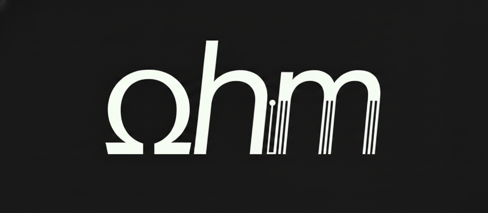

  <picture>
    <source media="(prefers-color-scheme: dark)" srcset="./assets/ohm-transparent-dark.png">
    <source media="(prefers-color-scheme: light)" srcset="./assets/ohm-transparent-light.png">
    
  </picture>

  <h4 align="center">
    <a href="ohm.moe">pi-ohm</a>
  </h4>
  
  

> 🚧 WIP 🚧
>
> This project is in progress. Please take anything you read here with a grain of salt as it may be be (1) outdated, (2) agent hallucinated, and/or (3) scaffolding/not implemented yet.
>
> 🚧 WIP 🚧

---

<h3 align="left">Packages</h3>

    
<strong>click to expand</strong>

  <h4><code>pi-ohm</code></h4>
  

The full feature bundle for Pi. Installs modes, memories, handoff, subagents, session/thread search, painter/imagegen, and references. It also exposes bundle diagnostics through <code>/ohm-features</code>, <code>/ohm-config</code>, and <code>/ohm-missing</code>.

  <h4><code>@pi-ohm/core</code></h4>
  

Shared runtime primitives for pi-ohm packages: config loading, event helpers, logging, DB migrations, jobs, grammar/path/toolkit utilities, and <code>@pi-ohm/core/pip</code>. Root <code>@pi-ohm/core</code> imports stay DB-free so lightweight consumers do not pull libsql.

  <h4><code>@pi-ohm/tui</code></h4>
  

Reusable Pi TUI pieces for pi-ohm packages. Includes the Ohm config inspector, input status helpers, subagent task tree components, deterministic line renderers, and <code>/ohm-tui-preview</code> for manual smoke tests.

  <h4><code>@pi-ohm/subagents</code></h4>
  

Relies on <code>@pi-ohm/core/pip</code>, our "Pi-in-Pi" (PiP) runtime, to spawn child Pi SDK processes. Hopefully, this makes our implementation more resistant to future Pi updates. PiP also allows you to embed Pi into any application that uses NodeJS. Ships <code>/subagents</code>, the subagent controller tool, and configurable default agents.

  <h4><code>@pi-ohm/handoff</code></h4>
  

Handoff and handoff visualizer support for Pi. Owns <code>/ohm-handoff</code>, shared handoff config, status rendering, and the below-editor visualizer scaffold for future resume-tree and handoff links.

  <h4><code>@pi-ohm/session-search</code></h4>
  

Session and thread search support for Pi. Current package owns <code>sessionSearch</code> config, status rendering, and <code>/ohm-session-search</code>; it is the home for session query and thread index tooling.

  <h4><code>@pi-ohm/memories</code></h4>
  

Codex-style memory for Pi. Background jobs scan eligible prior sessions, consolidate selected memory into <code>memory_summary.md</code>, inject that summary into future turns, and strip hidden memory citation blocks from finalized assistant messages.

  <h4><code>@pi-ohm/modes</code></h4>
  

Rush, smart, and deep mode controls for Pi. Registers <code>/ohm-modes</code> to inspect available modes and <code>/ohm-mode &lt;rush|smart|deep&gt;</code> to select the desired default mode shape.

  <h4><code>@pi-ohm/painter</code></h4>
  

Painter and image generation support for Pi. Centralizes provider config and status for Google Nano Banana, OpenAI, and Azure OpenAI, with diagnostics available through <code>/ohm-painter</code>.

  <h4><code>@pi-ohm/references</code></h4>
  

Project references for Pi. Adds named local directories and Git repositories to agent guidance, provides <code>@alias</code> autocomplete in the TUI, emits compact reference prompt blocks, and rewrites read-only path tool arguments from <code>@alias</code> to absolute paths.

  <h4><code>@pi-ohm/goal</code></h4>
  

Codex-style persistent session goals for Pi. Owns the package DB schema, runtime accounting, idle continuation, <code>/goal</code>, <code>/ohm-goal</code>, and model tools <code>get_goal</code>, <code>create_goal</code>, and <code>update_goal</code>.

  <h4><code>@pi-ohm/profiler</code></h4>
  

Pi extension startup profiler. Runs isolated benchmark processes, reports slow extension load and lifecycle records, shows an <code>ohm profiler</code> startup widget, and exposes diagnostics through <code>/ohm-profiler</code>.

  <h4><code>@pi-ohm/pip-flue</code></h4>
  

Flue adapter for PiP. Lets pi-ohm packages run Flue-backed child agents through the generic <code>PipRunner</code> contract from <code>@pi-ohm/core/pip</code>, while keeping Flue-specific SDK and server concerns out of core.

